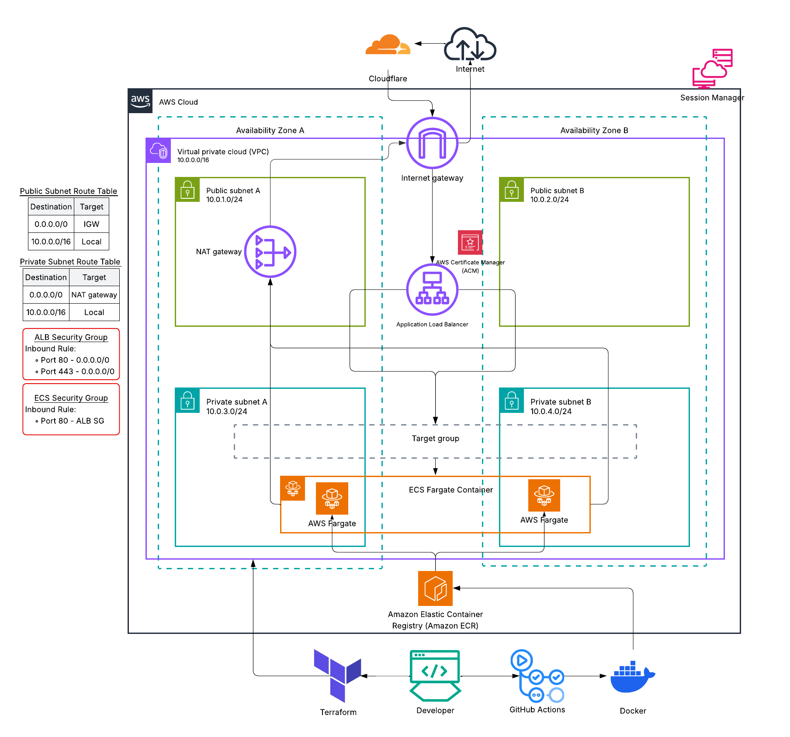

# threat-composer-ecs

### Objective
Build, containerise and deploy the threat composer application using **Docker**, **Terraform**, and **ECS**, with **HTTPS** and a **custom domain**

## Overview

A containerised web application deployed to AWS using production-grade infrastructure.

The infrastructure is fully defined in Terraform, deployed to ECS Fargate behind an Application Load Balancer, served over HTTPS via a custom domain managed on Cloudflare. A GitHub Actions pipeline handles automated builds and deployments on every push to `main`.


## Architecture




## Networking


## Local App Setup
> yarn and served installed `npm install -g yarn serve`

```
cd app
yarn install
yarn build
yarn global add serve
serve -s build

#yarn start
http://localhost:3000/workspaces/default/dashboard
```

## Docker

```Dockerfile
# Build the image
docker build -t threat-composer:latest .

# Run the image
docker run -p 80:80 threat-composer:latest

# http://localhost:8080
```

## Terraform

Infrastructure is fully defined as code using Terraform, organised into reusable modules.

| Module        | Description                                              |
| ------------- | -------------------------------------------------------- |
| `modules/vpc` | VPC, public/private subnets, NAT gateway, route tables   |
| `modules/ecr` | ECR repository for container images                      |
| `modules/acm` | ACM certificate with Cloudflare DNS validation           |
| `modules/alb` | Application Load Balancer, listeners, target group       |
| `modules/ecs` | ECS cluster, Fargate service, task definition, IAM roles |

### Usage

```bash
cd terraform
cp terraform.tfvars.example terraform.tfvars
# Fill in cloudflare_zone_id and other values

source ../.env  # Load CLOUDFLARE_API_TOKEN
terraform init
terraform plan
terraform apply
```

---

## Troubleshooting

### ALB HTTPS listener failing with `UnsupportedCertificate`

The ACM module `certificate_arn` output was returning the ARN directly from `aws_acm_certificate.cert.arn`, which is available immediately even when the certificate is still `PENDING_VALIDATION`. The ALB listener tried to attach the certificate before it was issued.

**Fix:** Return the ARN from the validation resource instead, which only resolves after the certificate reaches `ISSUED` status:

```hcl
output "certificate_arn" {
  value = aws_acm_certificate_validation.validated_certificate.certificate_arn
}
```

---

### Cloudflare provider namespace error

Terraform defaulted to looking for the Cloudflare provider under `hashicorp/cloudflare` instead of `cloudflare/cloudflare` when it was used inside the ACM module.

**Fix:** Add a `required_providers` block inside `modules/acm/main.tf`:

```hcl
terraform {
  required_providers {
    cloudflare = {
      source = "cloudflare/cloudflare"
    }
  }
}
```

---

### `tm.ska-cloud.uk` not resolving

The ACM DNS validation CNAME was created in Cloudflare but the app CNAME pointing `tm.ska-cloud.uk` to the ALB was never added. The domain had no A or CNAME record for user traffic.

**Fix:** Add a `cloudflare_dns_record` resource in root `main.tf`:

```hcl
resource "cloudflare_dns_record" "app" {
  zone_id = var.cloudflare_zone_id
  name    = "tm"
  type    = "CNAME"
  content = module.alb.alb_dns_name
  ttl     = 300
  proxied = false
}
```
